# ArtSphere 


Welcome to ArtSphere 🖼️, a vibrant and innovative social media web app dedicated to the artistic souls of the world. Just like a painter's canvas, the platform provides a blank space for actors, musicians, writers, and visual artists to express themselves and connect with a global community that shares their passion for art and culture, developed with Next.js 13 🔼 and tailwind 🌬️.

## Project Overview

ArtSphere aims to bridge gaps in art and culture, creating an inclusive virtual sphere where creativity knows no bounds. It's more than just a Twitter replica; it's a creative hub where you can showcase your talents, collaborate with like-minded artists, and explore the endless possibilities of artistic expression.

## Table of Contents 📜

- Features
- Getting Started
- Contributing
- License
- Contact

## Features 🌟

ArtSphere offers a plethora of features designed to inspire and empower artists:

- Profile Showcase: Create a profile that reflects your artistic identity with images, bios, and links to your works.

- Posts and Updates: Share your thoughts, artwork, or performances with the world through text, images, and videos.

- Connect and Collaborate: Connect with fellow artists, follow their journeys, and collaborate on artistic projects.

- Hashtags and Trends: Discover the latest trends and explore a universe of hashtags to find art that resonates with you.

- Notifications: Stay updated with real-time notifications on new followers, likes, and comments on your posts.

- Private Messaging: Engage in one-on-one conversations with your creative peers.

- Verified Profiles: Stand out as a verified artist, enhancing your credibility within the community.

- Dark Mode: Choose the theme that suits your mood and enhances your creativity.

- Explore Art: Dive into a gallery of artistic posts, from poetry and music to paintings and dance.

## Getting Started 🚀

First, install all the required packages by running:
```bash
npm install
# or
yarn install
```

then, run the development server:

```bash
npm run dev
# or
yarn dev
```

Open [http://localhost:3000](http://localhost:3000) with your browser to see the result.

You can start editing the page by modifying `app/page.tsx`. The page auto-updates as you edit the file.

[API routes](https://nextjs.org/docs/api-routes/introduction) can be accessed on [http://localhost:3000/api](http://localhost:3000/api). These endpoints can be edited in `app/api`.

The `app/api` directory is mapped to `/api/*`. Files in this directory are treated as [API routes](https://nextjs.org/docs/api-routes/introduction) instead of React pages.

<br>

## Screenshots

<br>

<table>
  <thead>
    <tr>
      <th>Desktop</th>
      <th>Mobile/Responsive</th>
    </tr>
  </thead>
  <tbody>
    <tr>
      <td>
        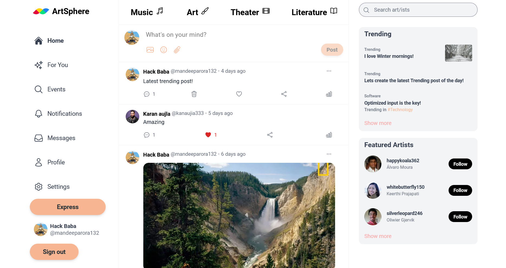
      </td>
      <td>
        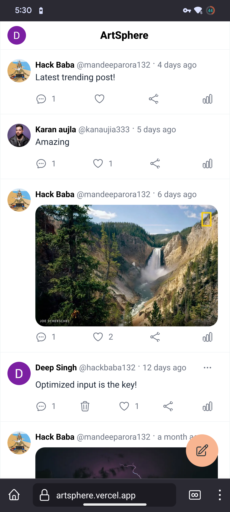
      </td>
    </tr>
    <tr>
      <td>
        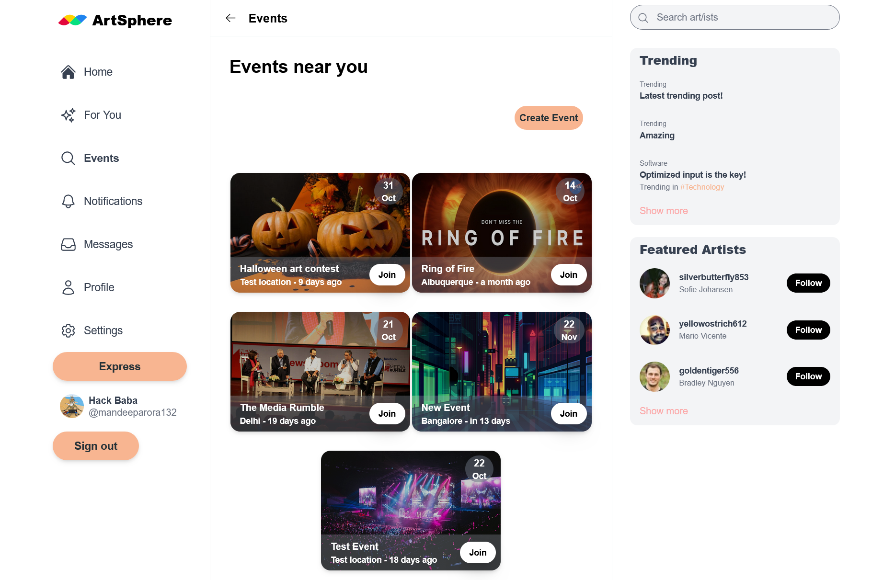
      </td>
      <td>
        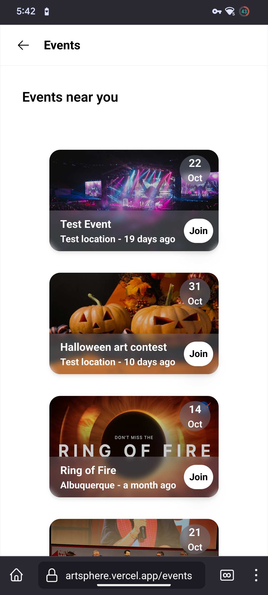
      </td>
    </tr>
    <tr>
      <td>
        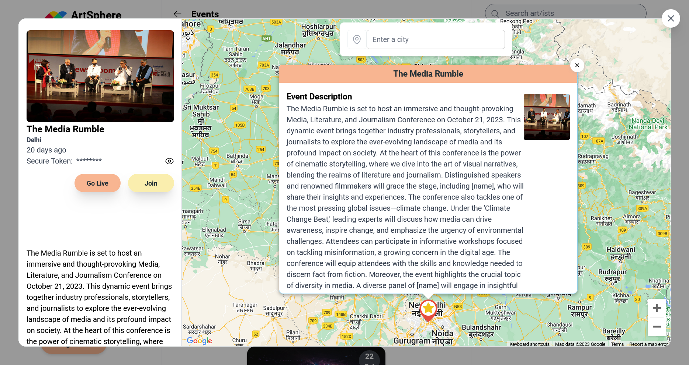
      </td>
      <td>
        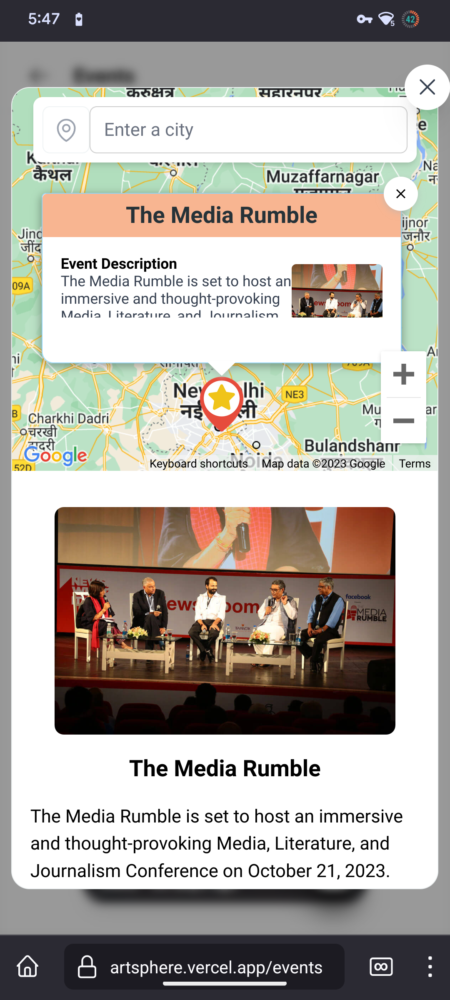
      </td>
    </tr>
    <tr>
      <td>
        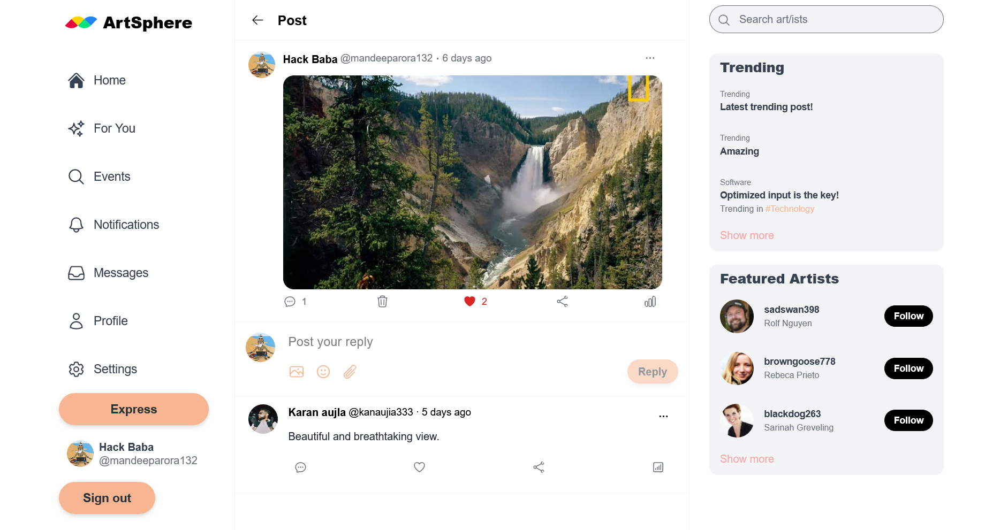
      </td>
      <td>
        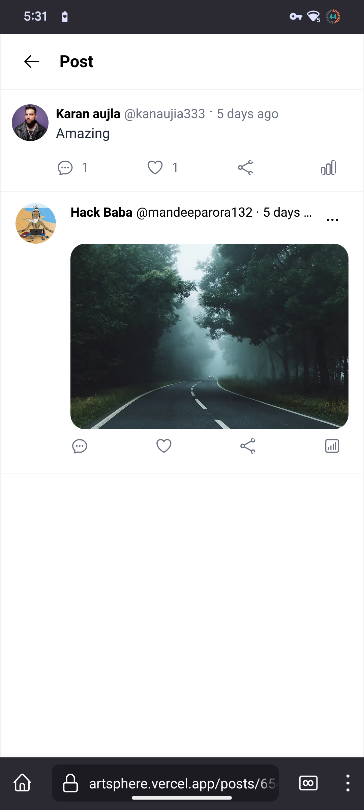
      </td>
    </tr>
    <tr>
      <td>
        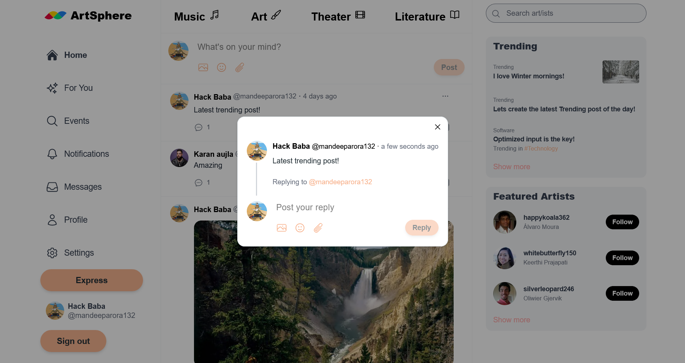
      </td>
      <td>
        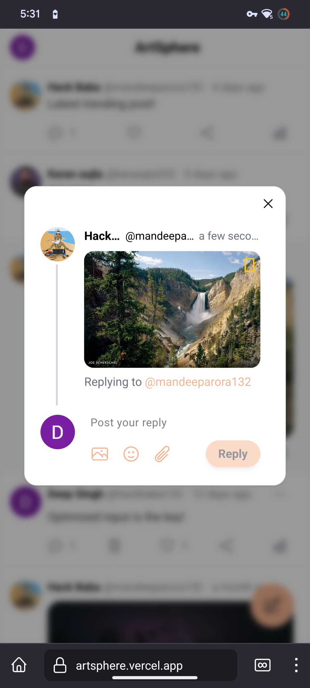
      </td>
    </tr>
    <tr>
      <td>
        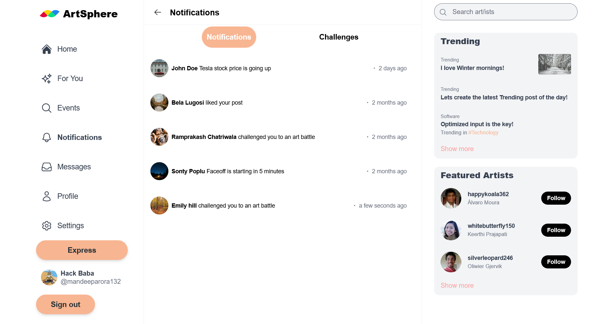
      </td>
      <td>
        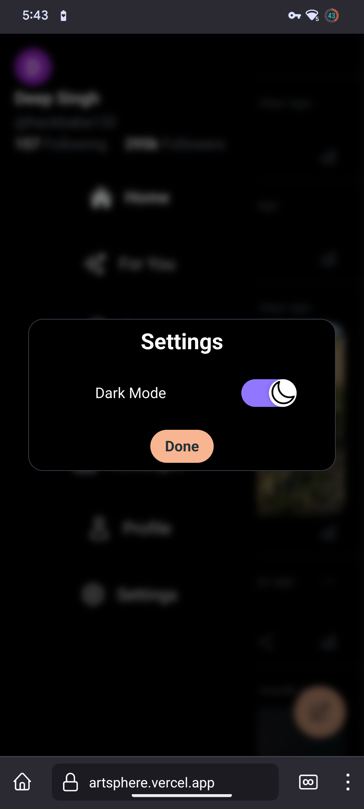
      </td>
    </tr>
    <tr>
      <td>
        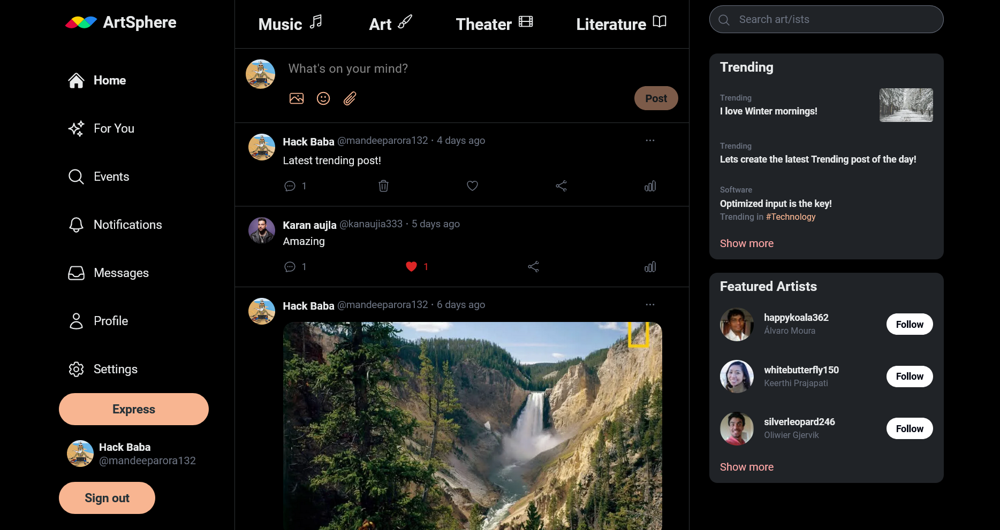
      </td>
      <td>
        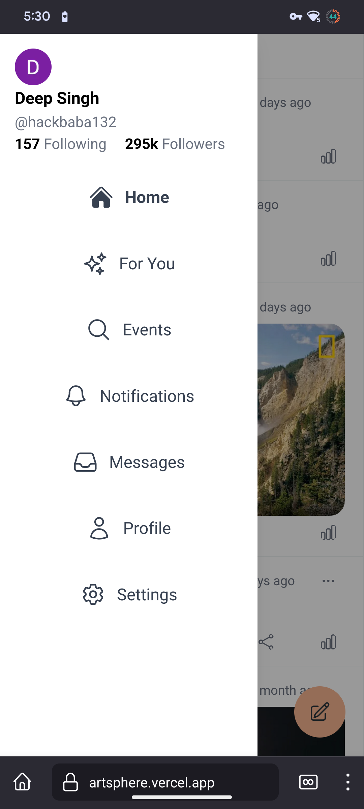
      </td>
    </tr>
  </tbody>
</table>

## Contributing 🤝

We welcome contributors who want to make ArtSphere an even better platform for artists. Feel free to fork the repository and submit pull requests to enhance the app.

## License

ArtSphere is licensed under the MIT License. You are free to use and modify the code, so long as you include the appropriate attribution.

## Contact 📧

If you have any questions or suggestions regarding the project, please feel free to reach out to me at [mandeeparora132@gmail.com](mailto:email@example.com).

Join ArtSphere, the canvas of endless creativity, and unleash the artist within you!
